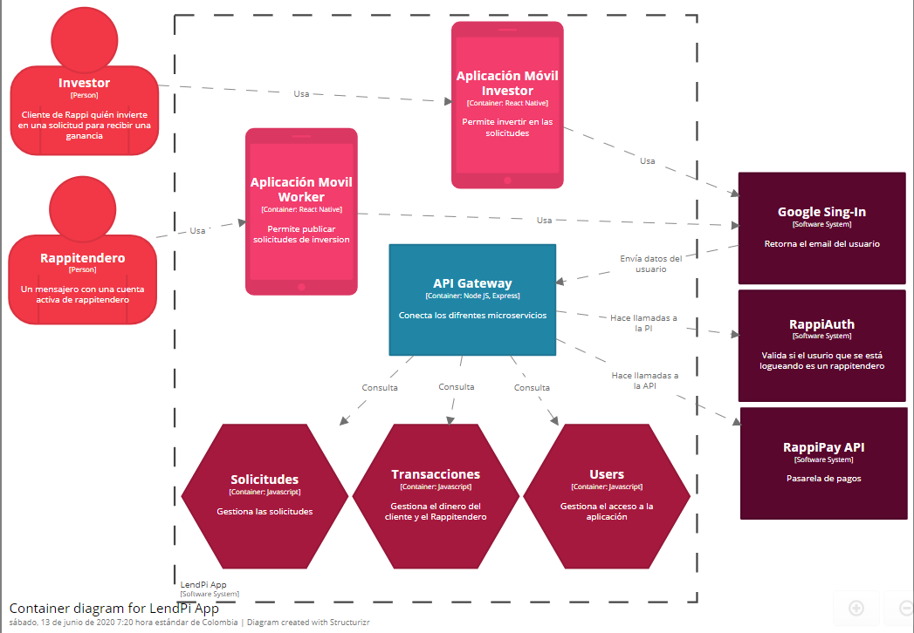

# Lendpi App

Lendpi is a crowdlending service created alongside Rappi whose main focus is to help people gain easier access to a loan. Currently the transactions stage of the application is emulated with a database but it shows what the objective and the functionality of the project is. This was created using the P.E.R.N stack and mounted on Heroku instances to handle the databases and microservices.


## Table of Content

- Examples of use
- C4 Model
- Development Environment Configuration
- Built With
- Authors
- License


## Examples of use


## C4 Model





## Development Environment Configuration

- Create a new folder called “Lendpi”.

- Inside the folder create a new react-native project called **app**:

    ```bash
  npx react-native init app
  ```

- Download the files from this repository.

    ```bash
  git clone https://github.com/Virteip/Lendpi.git
  ```

- Enter the cloned project's folder.

  ```bash
  cd Lendpi
  ```

- Switch to the 'develop' branch.

  ```bash
  git checkout develop
  ```

- Delete the following files from the new project you just created root folder: **App.js** and **index.js**.

- Copy the following files from the cloned **Lendpi**/investor or **Lendpi**/worker folder to the root of the new project you created.
  - assets/
  - components/
  - model/
  - screens/
  - App.js
  - index.js

- Go to the file `android/app/build.gradle` and add the following line at the end of the file:

    ```
    apply from: "../../node_modules/react-native-vector-icons/fonts.gradle"
    ```

- Download and install the following modules from the project's root folder:
  - yarn add @react-navigation/native
  - yarn add react-native-reanimated react-native-gesture-handler react-native-screens react-native-safe-area-context @react-native-community/masked-view
  - yarn add react-native-paper
  - yarn add react-native-vector-icons
  - yarn add @react-navigation/stack
  - npm install react-native-animatable --save
  - npm install react-native-linear-gradient --save
  - yarn add @react-navigation/drawer
  - yarn add @react-navigation/material-bottom-tabs
  - npm install react-hook-form
  - yarn add @react-native-community/async-storage
  - yarn add @react-native-community/google-signin
  - yarn add @react-native-community/toolbar-android
  
- Execute the app
  
  - npx react-native run-android


## Built With

- [Javascript](https://www.javascript.com/) - Programming language
- [PostgreSQL](https://www.postgresql.org/) - Database
- [Express](https://expressjs.com/) - Framework
- [React Native](https://reactnative.dev/) - Framework
- [Node](https://nodejs.org/en/) 


## Authors

- **Sergio Pietri** 
  - **@SergioPietri** 
  -  https://github.com/Virteip/
- **Julián Sandoval**
  - **@derhks** 
  -  https://github.com/Derhks
- **Yojan Castellanos**
  - **@davcastellanosp** 
  -  https://github.com/davidcastellanos


## License

Public Domain. No copy write protection.